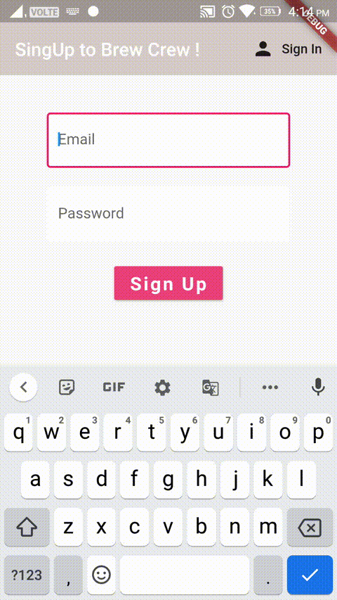
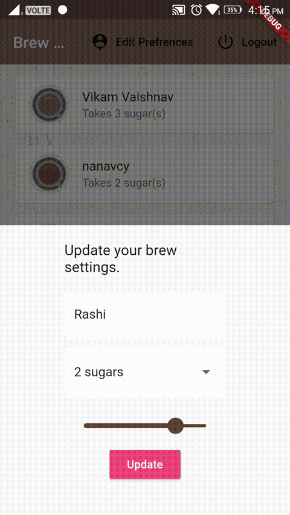

# Brew Crew App

If you have a large friend circle then it bit a tough task to remember and bring Coffee as each of their preferences.

To do this tough task easy I have built this Brew Crew app.

Register -> Login > See others Brew Prefrences -> Edit your own Brew Preferences.

## Features

I have used Stream listener So if the user is already logged in then it will show **Home Screen** OR It will show **SingIn Screen** Automatically

### Register

Skills I learned: 
- Firebase Authentication- RegisterWithEmailAndPassword
- Formfield
- Validator for Formfield
- Firebase Stream
- Provider Package
- Loading Widget

### SigIn 

Skills I learned: 
- Firebase Authentication- SignInWithEmailAndPassword
- Firebase Stream to listen to the change in Firebase auth states

### Home and Update Brew preference

Skills I learned: 
- Firebase Firestore used and linked logged In user to FirebaseFirestore database.
- Accessing Firestore Collection/Document/Fields
- Create 3 Stream  
  - Firebase Stream to listen to the change in Firebase auth states.
  - To listen to the change in Brew Documents of different users.
  - To Listen to change of update in current user data.

### SignOut
- Firebase Auth - Signout.

## Contributing
Pull requests are welcome. For major changes, please open an issue first to discuss what you would like to change.

Please make sure to update tests as appropriate.

## License
[MIT](https://choosealicense.com/licenses/mit/)